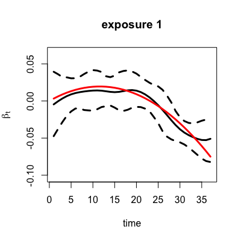

# BayesianDLAG

This is an R package to implement the ideas in Antonelli et. al (2021) to estimate ditributed lag models with multiple exposures, i.e. environmental mixtures.

Please don't hesitate to contact Joseph Antonelli with any questions at jantonelli111@gmail.com. Please report any bugs if you encounter any as well!

# How to install BayesianDLAG

The first thing we need to do is install the library, which can be done using the following

```
library(devtools)
install_github(repo = "jantonelli111/BayesianDLAG")
library(BayesianDLAG)
```

# How to use the software

To illustrate how to use the software, we will first simulate a simple scenario with 5 exposures. We have provided a function that simulates a data set with repeatedly measured exposures. This function can be customized to allow for different true relationships between the exposures and outcome, though we will use the default setting here which simulates a data set such that the first two exposures affect the outcome and have an interaction between them. We simulate exposures that have an AR(1) correlation structure between them with correlation parameter given by corr_exposures. We also force temporal dependence within exposures using corr_time. 

```{r, eval=FALSE}
data = createDataDLAG(n=200, p=5,, 
                      corr_exposures = 0.5,
                      corr_time = 0.9)
                      
x = data$x
y = data$y
c = data$c
```

Now we will illustrate how to implement our model to estimate the distributed lag effects of this environmental mixture. There are two main functions in the R package that fit these distributed lag models, which are given by DLAGbayes() and DLAGbayesAlpha(). The first of these two functions, DLAGbayes() does not perform hyperparameter selection to maximize power and control posterior inclusion probabilities at a particular level. This function simply provides a fully Bayesian analysis to our model with all hyperparameters assigned a prior distribution. The main function DLAGbayesAlpha() additionally tries to find the tuning parameter values that give the desired posterior inclusion probabilities for exposures and interactions with no effect on the outcome. We recommend using this function as it has been shown to have substantially higher power to detect signals than the fully Bayesian procedure in DLAGbayes(). The one drawback of the more advanced approach is that it is computationally slower than the fully Bayesian approach. It will take longer to set up the MCMC as it is searching for optimal hyperparameter values. 

```{r, eval=FALSE}
## MCMC specifications (we recommend running for longer in practice 
## and examining for convergence across multiple chains)
nScans=2000
nBurn=500
thin=3

## Fully Bayesian model with interaction surfaces reduced via PCA
ModelFBreduced = DLAGbayes(y=y, x=x, c=c, nScans=nScans, nBurn=nBurn, thin=thin)

## Same model but with hyperparameters chosen to control PIPs and maximize power
ModelFDtau =     DLAGbayesAlpha(y=y, x=x, c=c, nScans=nScans, nBurn=nBurn, thin=thin,
                                alphaMain = 0.1, alphaInt = 0.05)
```

# Visualizing the results

Now let's compare the results between these two approaches in terms of posterior inclusion probabilities and estimated distributed lag surfaces. First let's look at the PIPs for the main effects

```{r, eval=FALSE}
## Main effects PIPs
cbind(ModelFBreduced$gamma$PIP,
          ModelFDtau$gamma$PIP)
```


```{r, eval=FALSE}
## Interaction PIPs
cbind(ModelFBreduced$gammaInt$PIP,
          ModelFDtau$gammaInt$PIP)
```


We see that the FD tau approach does better in terms of identifying the important exposures (1 and 2) and interaction between them. Now let's visualize one of the estimated distributed lags from the model. Let's look at exposure 1 using the built in plotting functions

```{r, eval=FALSE}
## Plot the estimated main effects
PlotMainDLAG(DLAGmodel=ModelFDtau, whichExposure=1)

## add in the true effect
lines(1:37, data$betaMain[[1]], col=2, lwd=3)
```



You can also extract the full posterior distribution of these quantities using the following function

```{r, eval=FALSE}
posterior = PosteriorMainDLAG(DLAGmodel=ModelFDtau, whichExposure=1)
dim(posterior)
```

The posterior distribution has three dimensions: number of chains, number of MCMC samples kept per chain, and number of time points for the corresponding exposure. We can do the same thing for an interaction surface:

```{r, eval=FALSE}
posteriorInt = PosteriorInteractionDLAG(DLAGmodel=ModelFDtau, whichExposures=c(1,2))
dim(posteriorInt)
```

We can use this to visualize the interaction surface

```{r, eval=FALSE}
## Calculate posterior mean
posteriorMeanInt = apply(posteriorInt, 3:4, mean)
par(mfrow=c(1,2), pty='s')

## Estimated surface
image(posteriorMeanInt, axes=FALSE, main="Estimated")

## Truth
image(data$betaInt[[1]], axes=FALSE, main="Truth")
dev.off()
```


